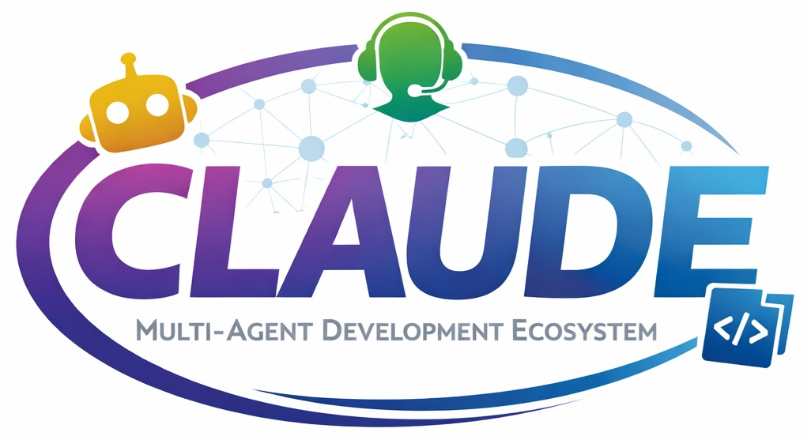

# CLAUDE: Multi-Agent Development Ecosystem (CLAUDE-MADE)



Implements the Claude **Orchestrator-Worker** pattern: Architect → Builder → Reviewer, with a hard 2-loop revision cap. Token consumption is automatically minimized via the built-in [OpenWolf](https://openwolf.com) middleware layer — no configuration needed.

## Prerequisites

- Python 3.13+
- Node.js 18+
- An Anthropic API key

## Setup

```bash
python3 -m venv .venv
source .venv/bin/activate
pip install -r requirements.txt
cp .env.example .env   # add your ANTHROPIC_API_KEY
```

## Run a task

```bash
python -m src.pipeline "Add a hello-world FastAPI endpoint at GET /health"
```

The pipeline will:

1. **Architect** — writes `handoff/task_brief.md`
2. **Builder** — implements the task, writes `handoff/build_result.md`
3. **Reviewer** — validates, writes `handoff/review_result.md`; loops back to Builder once if needed

## Structure

See `CLAUDE.md` for architecture, protocols, and the OpenWolf token optimization layer. See `AGENTS.md` for agent boundaries and handoff rules.
